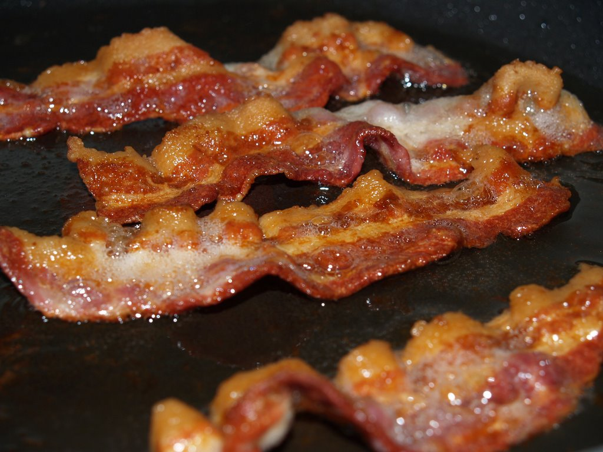

.. -*- coding: utf-8-with-signature-unix; fill-column: 77 -*-

=================
 IgniteBoulder23
=================

slide 0
=======

.. [ 0m0s ]

.. Everybody say "BACON!" "BACON!" "BACON!"

.. I eat nothing but bacon. 

slide 1
=======

.. [ 0m15s] [slide: food pyramid of meat]

.. .. XXX This crappy image is merely a place-holder. Need better replacement!

.. Bacon and other kinds of meat

.. Bacon and eggs for breakfast, baked chicken thighs for lunch, juicy, fatty ribeye steak for dinner, and for dessert: bacon.

.. No fruits, no vegetables, no grains.

.. I make exceptions sometimes, but on a *typical* day, that's my diet.

.. And has been for the last four and a half years.

Try This At Home! How I'm Using An Experimental Cancer Therapy On Myself Even Though I've Never Had Cancer
==========================================================================================================

by Zooko Wilcox-O'Hearn

.. [ 0m30s ] [wait for people to read slide and laugh ]

.. My name is Zooko, I'm the founder of a tech startup here in Boulder, and this is the talk about how I'm using an experimental cancer therapy on myself at home even though I've never had cancer.
 
slide 3
=======

.. [ 0m45s ]

.. Meeting my wife and having children with her is the best thing that's ever happened in my life so far, and when she got sick, it was the worst thing that's ever happened in my life so far.

slide 4
=======

.. [ 1m0s] [slide: Amber "before" in early 2009 or 2008? -- sorry, I don't agree to that — Am]

.. After we tried everything— *everything* … after we tried everything that the doctors could think of, and she just kept getting worse and worse, then the surprising thing that fixed it was when she started eating only meat.

slide 5
=======

.. [ 1m15s] [slide: Amber in about 2010? ditto]

.. I thought this was kooky and weird, so if you're thinking that this is kooky and weird, I'm right there with you.

.. But in addition to making her well, it had another effect: she lost weight; a *lot* of weight. She went from almost 190 pounds to 130 pounds. And she looks really good.

slide 6
=======

.. [ 1m30s ]

.. I, too, was fat: I had a big round belly and my butt was big and flabby, and I hated that. So after I saw how healthy and effective the diet was for her I started doing it.

slide 7
=======

.. [ 1m45s ]

.. image:: Mitochondria,_mammalian_lung_-_TEM.jpg
   :width: 800 px

.. Let's look at the science, because I don't want any pseudoscience in my life or in your life. It turns out that the science *totally backs this up*!

.. The way we had learned about this was by rejecting “Health Authorities” and doing our own research. We made a hobby of reading books on the topic and of downloading science papers from the Internet and reading them.

.. [ 2m0s ]

.. It turns out that reading science papers is not that hard! It just takes persistence.

.. What we learned is that eating nothing but meat is one way to do what is called a "ketogenic diet". It's not the only way, but it is the simplest.

.. [ 2m15s ]

.. A "ketogenic diet" is a diet that puts you in the ketotic state, which means is that all of the mitochondria inside your cells switch over from burning sugar for fuel to burning fat for fuel.

.. [ 2m30s ]

.. It took about four days for this to happen. The first four days were horrible—I was tired all the time and I couldn't think about anything but how much I wanted to go eat a dozen donuts.

.. [ 2m45s ]

.. But on the fifth day that feeling disappeared and I started to feel great. For me it took four days to adapt; for some of my friends who have tried it, it has taken them four weeks to adapt.

.. It would make sense that if your mitochondria switch over to burning fat for fuel that this would be a good way to lose weight.

.. [ 3m0s ]

.. And it *is* a good way to lose weight! There have been more than twenty different experiments on real live fat humans in which scientists put them on a ketogenic diet and they lost weight better on that diet than on the other diets.

.. [ references: Bueno-2013-“Very-low-carbohydrate ketogenic diet v. low-fat diet for long-term weight loss: a meta-analysis of randomised controlled trials”, Hu-2012-“Effects of Low-Carbohydrate Diets Versus Low-Fat Diets on Metabolic Risk Factors: A Meta-Analysis of Randomized Controlled Clinical Trials”, Schwingshackl-2013-“Comparison of Effects of Long-Term Low-Fat vs High-Fat Diets on Blood Lipid Levels in Overweight or Obese Patients: A Systematic Review and Meta-Analysis”, Santos-2012-“Systematic review and meta-analysis of clinical trials of the effects of low carbohydrate diets on cardiovascular risk factors” ]

.. [ 3m15s ]

.. Your mitochondria changing over to this alternative metabolism has profound effects on your body in addition to losing excess body fat.

.. It turns out that a ketogenic diet is *the* most effective treatment for epilepsy that has ever been tested. It is more effective at stopping seizures and curing epilepsy than any drug.

.. [ references: Neal-2010-“Efficacy Of Dietary Treatments For Epilepsy” ]

.. [ 3m30s ]

.. And there is an exciting new possibility on the horizon. There is reason to hope that the ketogenic diet may be a treatment against cancer!

.. [ 3m45s ]

.. There have been several experiments on mice in which ketotic mice were saved from cancer which killed non-ketotic mice.

.. [ references: Ho-2011-“A Low Carbohydrate, High Protein Diet Slows Tumor Growth and Prevents Cancer Initiation”, Poff-2013-“The Ketogenic Diet and Hyperbaric Oxygen Therapy Prolong Survival in Mice with Systemic Metastatic Cancer”, Venkateswaran-2007-“Association of Diet-Induced Hyperinsulinemia With Accelerated Growth of Prostate Cancer (LNCaP) Xenografts”, Kalaany-2009-“Tumours with PI3K activation are resistant to dietary restriction”, Mavropoulos-2009-“The Effects of Varying Dietary Carbohydrate and Fat Content on Survival in a Murine LNCaP Prostate Cancer Xenograft Model” ]

.. There is an explanation for why that would make sense, which is that cancer cells are sugar-dependent! For some weird reason, in most types of cancer their mitochondria are defective…

.. [ 4m0s ]

.. … and have have *lost* the ability to switch over to the fat-burning metabolism. So it would make sense that if you feed yourself nothing but meat, all of your healthy cells will switch over to the ketotic metabolism but the cancer cells can't switch over, so they starve.

.. [ 4m15s ]

.. At least that's the theory. There are now nine separate clinical trials underway in which they put cancer patients on a ketogenic diet to see what happens. The results of those experiments will be published over the next two to five years.

.. [ slide? reference: http://clinicaltrials.gov/ct2/results?term=ketogenic+diet+AND+cancer&recr=Open&no_unk=Y ]

.. [ 4m30s ]

.. I'm really hoping that it will turn out that this diet is as effective a therapy against cancer as it is against epilepsy. If that works out, then it will be the biggest breakthrough against cancer *ever*.

.. [ 4m45s ]

.. In conclusion, I have two challenges for you: 1. Don't believe everything you're told, even by the “Health Authorities”. Do your own research like we did; be skeptical and be brave. 2. Try eating nothing but meat for a few weeks and see how you feel!

.. [ 5m0s ]

.. [ final slide just has: "ketotic.org" ]

.. [ As soon as they applaud: "BACON!!!" ]
